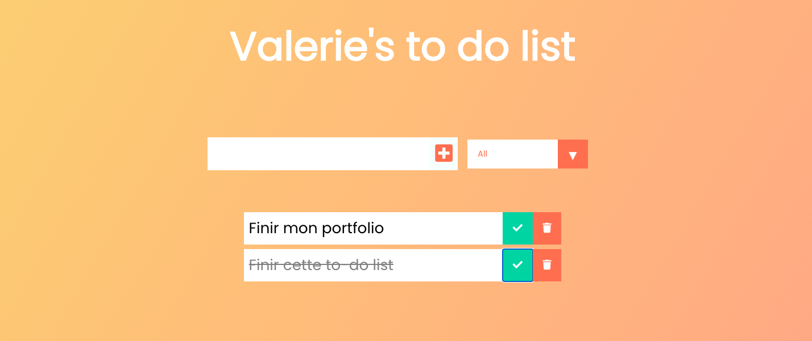

TO DO LIST REACT

-Création de composant \
-Props \
-Hooks : useState , useEffect \
-Fonctionnalités :

- texte inséré dans l'input s'ajoute à la liste
- un bouton "completed" qui barre la tâche achevée
- un bouton delete qui supprime la tâche
- une liste selective qui filtre les tâches (all, completed, uncompleted)
